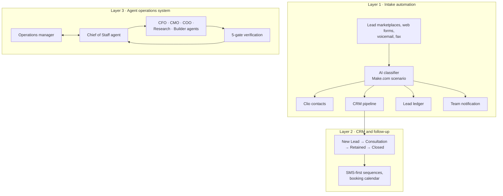

# Law Firm OS

The operations architecture I built and run for a real criminal defense and
personal injury practice. Not a demo and not a chatbot. It is the firm's
working back office: AI intake classification feeding four systems of record,
a CRM layer handling follow-up and booking, and a multi-agent operations
system with attorney-client privilege enforced in code at the tool layer.

> **About this repository.** This is an architecture portfolio, not a
> deployable product. The firm, its people, and its clients are anonymized
> throughout. The enforcement hooks in [`hooks/`](hooks/) are sanitized
> versions of the production code. Commodity platforms (Clio, Make.com,
> GoHighLevel, HubSpot) are named because naming them is what makes the
> integration work legible.

## Why a law firm is the hard mode of AI operations

Law practice is a regulated, privilege-bound, deadline-driven business where
a wrong autonomous action has professional-responsibility consequences. That
constraint shaped every design decision here. The system is built on one
principle: **draft and surface, never execute.** Agents research, classify,
draft, and flag. Humans send, sign, file, and spend. The interesting
engineering is in making that boundary real instead of aspirational.

## The three layers



### Layer 1: AI intake that does a coordinator's job

Every inbound lead channel funnels into one Make.com scenario where an LLM
classifier does the discrimination work a human intake coordinator would do.
It separates leads from voicemails from faxes, extracts contact details and
arrest jurisdiction, ignores internal addresses, and catches lead-vendor
refund notices that would otherwise create phantom clients in the CRM. Clean
records then fan out to four systems simultaneously: the practice management
system (Clio), the CRM, a spreadsheet ledger, and team chat. Details in
[docs/intake-pipeline.md](docs/intake-pipeline.md).

### Layer 2: CRM follow-up that never drops a lead

A GoHighLevel pipeline moves each contact from New Lead through Consultation
Scheduled to Retained, with SMS as the primary follow-up channel and the
booking calendar embedded on the firm's site. Monitoring exists because of a
scar: a contact form once failed silently, so the stack now alerts on
zero-conversion windows instead of trusting green checkmarks.

### Layer 3: an agent org chart, not an assistant

The operations layer is a small organization of specialized agents modeled on
an executive team. One orchestrator, the Chief of Staff, is the only agent
the human operator addresses. It dispatches to specialists, verifies every
result through five gates, and returns one synthesized answer.

| Agent | Role | Autonomy ceiling |
|---|---|---|
| Chief of Staff | Routing, verification, institutional memory | Sole writer of the memory ledger |
| Research | State criminal and PI law, statute verification | On-demand only, citations mandatory |
| COO | Court and administrative deadlines, scheduling | Drafts only, never sends |
| CFO | Billing drafts, P&L review, trust-account hygiene flags | No entries, no money movement |
| CMO | SEO, web copy, review responses | Publishing requires human approval |
| Builder | Scripts, dashboards, integrations | New integrations require authorization |

Full design in [docs/agent-operations.md](docs/agent-operations.md).

## Privilege enforced in code, not prompts

The part I would defend in front of any bar association: the privacy protocol
is not an instruction the model is asked to follow. It is a set of PreToolUse
hooks that inspect every tool call before it executes and deny the ones that
touch protected ground.

- **[`hooks/block_protected.sh`](hooks/block_protected.sh)** denies any tool
  call whose path-like fields reference protected client files, the practice
  management folder, personal document folders, or co-counsel matter content.
  It inspects search queries too, because a Drive search naming a protected
  folder is access by another name.
- **[`hooks/scan_write_pii.sh`](hooks/scan_write_pii.sh)** scans every write
  for SSN and date-of-birth shaped patterns and denies on match.
- **[`hooks/memory_log_check.sh`](hooks/memory_log_check.sh)** blocks session
  end until substantive work is recorded in the append-only institutional
  memory ledger.

Every allow and deny writes a JSON audit line, rolled up daily to a readable
summary. The scrubber caught a real SSN-shaped string in a draft on day one,
and the audit trail has the receipt. A standing rule even bars agents from
synthesizing fake PII to test the detectors, so test data cannot become a
leak vector. Full writeup in
[docs/privacy-engineering.md](docs/privacy-engineering.md).

## The verification gate

No agent output reaches the human without passing five checks run by the
orchestrator: scope (stayed in its lane), verification (proved its own work),
format (the fixed five-field report), privacy (no PII), and completeness
(blockers surfaced, never hidden). Self-reported "done" without evidence gets
sent back. Every agent, every task, reports in the same shape:

```text
TASK:      what was assigned, one line
STATUS:    Complete · In Progress · Blocked · Needs Approval · Failed
SUMMARY:   what was done and the result
FLAGS:     what the human must decide or know, "None" if clean
NEXT STEP: who does what next
```

## Design decisions worth stealing

1. **The system of record is untouchable.** The practice management system
   holds client cases. Agents operate around it, never inside it, and the
   hook layer makes that physical rather than polite.
2. **One agent talks to the human.** Specialists never surface raw output.
   The orchestrator verifies, redacts, and synthesizes, which keeps the
   human's attention budget flat as the agent count grows.
3. **Memory is append-only and single-writer.** One ledger, one authorized
   writer, entries never edited. Institutional memory you can audit beats
   memory you can quietly rewrite.
4. **Autonomy is a table, not a vibe.** Reading, research, and drafting are
   autonomous. Anything that moves a file, sends a message, touches money, or
   publishes requires explicit human approval. The table is enforced, logged,
   and boring, which is the point.
5. **Local-only workspace, allowlist mirror.** The agent workspace never
   syncs to cloud storage. A one-way rsync exposes only firm-public documents,
   verified so agent internals and logs stay out.

## Status

Built and operating in phases. The intake and CRM layers run in production.
The agent layer is mid-rollout: orchestrator and research agents validated
and active, finance and operations agents through design and awaiting
validation, marketing and builder agents next. The phased order is
deliberate. In this environment you validate each agent against real
guardrails before the next one exists.
