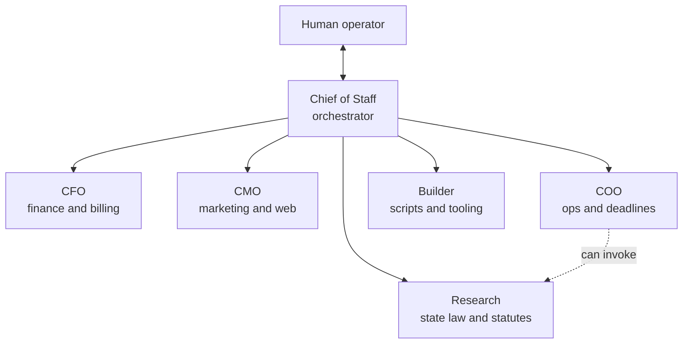

# The agent operations system

A small organization of specialized agents that runs the firm's back office.
The design mirrors a real executive team because the failure modes of agent
systems are organizational failure modes: unclear ownership, unverified
claims of completion, and side channels around the chain of command.

## Command structure

The Chief of Staff is the only agent the operator addresses directly. It
never does domain work itself. It routes, enforces protocol, verifies, and
synthesizes. Specialists never surface raw output to the human.

## Agent anatomy

Every agent is defined by a four-file identity set, read at every spawn
before any work happens:

| File | Contents |
|---|---|
| `SOUL.md` | Who the agent is, its jobs, its judgment rules |
| `AGENTS.md` | Who it may talk to and how reports flow |
| `TOOLS.md` | What it may touch, stated as capabilities |
| `IDENTITY.md` | ID, model, autonomy tier, current status |

Five backbone documents govern the whole system the same way: master session
instructions, the org chart, the protocol layer, live workspace state, and
the append-only memory ledger. Agents read all of them before acting. The
protocols are read-only to every agent.

## Dispatch patterns

The orchestrator chooses one of three dispatch modes per request:

- **Parallel** only when three or more unrelated tasks share no state and
  have clean file boundaries
- **Sequential** whenever there is any dependency, shared file, or unclear
  scope
- **Background** for research that does not block the current thread

Defaulting to sequential when scope is unclear is a deliberate anti-race
rule. Two agents editing adjacent state is how quiet corruption happens.

## The autonomy table

| Action | Autonomy |
|---|---|
| Read files, research, draft content | Autonomous |
| Write to knowledge base and outputs | Autonomous |
| Update the memory ledger | Orchestrator only |
| Move or rename any file | Human approval |
| Send any communication | Human approval plus review |
| Any financial entry | Human approval |
| Publish content, spawn an agent, edit protocols | Human approval |

Two entries deserve explanation. Trust accounting is flag-only: the CFO
agent can notice hygiene issues but the attorney decides, because trust
account rules carry professional discipline consequences. And no agent can
edit the protocols that constrain it, which closes the most obvious
self-modification loophole.

## Verification: the five gates

Every specialist result passes through the orchestrator's gate before the
human sees it:

1. **Scope** — did the agent stay in its lane
2. **Verification** — did it prove its own work, or just claim completion
3. **Format** — the fixed five-field report, missing a field means rejected
4. **Privacy** — any PII gets redacted and the incident logged
5. **Completeness** — partial work and blockers surfaced, never hidden

Gate 2 is the one that matters most in practice. Agents report success
optimistically. Requiring evidence with every completion claim converts
"done" from an assertion into a checkable statement.

## Memory

After every completed task the orchestrator appends one line to the memory
ledger: date, event, result, actor. Entries are never edited. Standing
decisions live at the top, the event log below. A session-close command
ritualizes the shutdown: reflect, append the memory line, update workspace
state, re-mirror public docs.

The ledger is what makes the system an institution instead of a series of
amnesiac sessions. A fresh session reads it and knows what was decided, what
failed before, and why the rules are shaped the way they are.

## Rollout discipline

Agents go live one at a time through a build-validate-activate sequence, and
each must pass validation against the live guardrails before the next agent
is designed. Orchestrator and research are active. Finance and operations
are through design. Marketing and builder are next. Slower than spawning six
agents from six prompts on day one, and that is the point: in a privilege
environment you earn autonomy one validated agent at a time.
