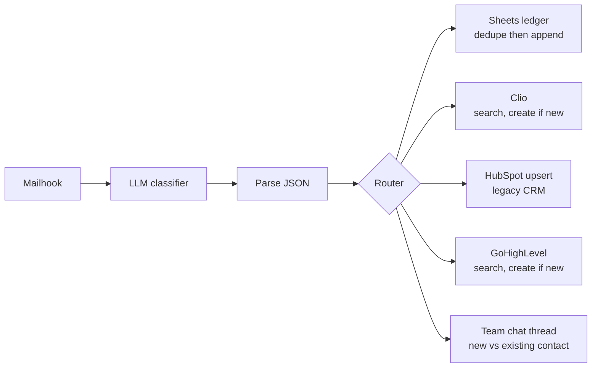

# The intake pipeline

Every lead channel the firm has funnels into one classification scenario, and
clean structured records come out the other side in four systems at once.

## Sources

- Legal lead marketplaces (Avvo and pay-per-lead vendors), arriving as
  templated notification emails
- Website contact and consultation forms, via the CRM's form widgets
- Voicemail transcriptions and fax notifications from the phone system
  (RingCentral), which share the email relay

All of it routes through a whitelisted relay address into a Make.com mailhook
trigger.

## The classifier is the interesting part

A single LLM step with a legal-intake system prompt does what a trained
intake coordinator does on first touch:

- Classifies each message as exactly one of lead, voicemail, or fax, plus a
  refund-notice type for vendor credit emails
- Extracts name, email, phone (normalized to digits), message body, source,
  city, and city of arrest
- Knows the templates: on marketplace emails the "To:" line is the attorney,
  not the lead, and internal firm addresses appearing in signatures are
  ignored
- Catches pay-per-lead refund and credit notices so they are logged for the
  refund ledger instead of becoming phantom clients in the CRM

That last rule exists because phantom contacts were a real failure mode.
A refund notice looks like a lead email to a dumb parser, and every one that
slips through pollutes conversion metrics and wastes a follow-up sequence on
a person who never inquired.

## Fan-out

Idempotency is handled per system: search-before-create in Clio and the CRM,
filter-before-append in the ledger. The team notification distinguishes
"contact already exists in Clio" from genuinely new, which is the difference
between a returning client and a fresh intake call.

A parallel scenario handles fax notifications with its own narrower
classifier (caller ID, phone, attachment URL) posting straight to team chat.

## Boundaries

The pipeline writes contact records into the practice management system. It
does not read case data, and it predates the agent layer entirely. Under the
agent operating system's rules, no agent touches the practice management
system at all. The Make.com scenario sits outside the agent trust boundary
as a fixed, human-built integration.

## What I would tell you in a design review

The classifier prompt carries the institutional knowledge here: vendor email
formats, template quirks, refund-notice patterns. That knowledge used to
live in one person's head and walked out the door with turnover. Putting it
in a versioned prompt made intake triage a system property instead of a
staffing property.
